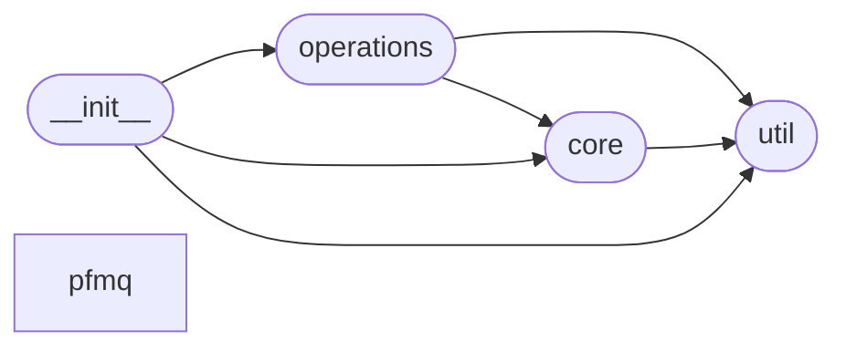

# Code Overview

[_Documentation generated by Documatic_](https://www.documatic.com)

<!---Documatic-section-Codebase Structure Python-start--->
## Codebase Structure Python

The codebase has a single-depth folder structure,
                with 9 code files in total.

<!---Documatic-block-system_architecture-start--->

<!---Documatic-block-system_architecture-end--->

# #
<!---Documatic-section-Codebase Structure Python-end--->

<!---Documatic-section-Key Objects-start--->
## Key Objects

There are exposed imports at level-0
from the source directory (pythonflow)

<!---Documatic-block-pythonflow-start--->

	
<code>pythonflow</code> (Click to Expand!)

* `pythonflow.core.EvaluationError`
* `pythonflow.core.Graph`
* `pythonflow.core.Operation`
* `pythonflow.core.abs_`
* `pythonflow.core.add`
* `pythonflow.core.all_`
* `pythonflow.core.and_`
* `pythonflow.core.any_`
* `pythonflow.core.ascii_`
* `pythonflow.core.attrgetter`
* `pythonflow.core.bin_`
* `pythonflow.core.bool_`
* `pythonflow.core.bytearray_`
* `pythonflow.core.bytes_`
* `pythonflow.core.call`
* `pythonflow.core.callable_`
* `pythonflow.core.chr_`
* `pythonflow.core.classmethod_`
* `pythonflow.core.compile_`
* `pythonflow.core.complex_`
* `pythonflow.core.concat`
* `pythonflow.core.contains`
* `pythonflow.core.control_dependencies`
* `pythonflow.core.countOf`
* `pythonflow.core.delattr_`
* `pythonflow.core.delitem`
* `pythonflow.core.dict_`
* `pythonflow.core.dir_`
* `pythonflow.core.divmod_`
* `pythonflow.core.enumerate_`
* `pythonflow.core.eq`
* `pythonflow.core.eval_`
* `pythonflow.core.exec_`
* `pythonflow.core.filter_`
* `pythonflow.core.float_`
* `pythonflow.core.floordiv`
* `pythonflow.core.format_`
* `pythonflow.core.frozenset_`
* `pythonflow.core.func_op`
* `pythonflow.core.ge`
* `pythonflow.core.getattr_`
* `pythonflow.core.getitem`
* `pythonflow.core.globals_`
* `pythonflow.core.gt`
* `pythonflow.core.hasattr_`
* `pythonflow.core.hash_`
* `pythonflow.core.help_`
* `pythonflow.core.hex_`
* `pythonflow.core.id_`
* `pythonflow.core.import_`
* `pythonflow.core.index`
* `pythonflow.core.indexOf`
* `pythonflow.core.input_`
* `pythonflow.core.int_`
* `pythonflow.core.inv`
* `pythonflow.core.invert`
* `pythonflow.core.ior`
* `pythonflow.core.ipow`
* `pythonflow.core.irshift`
* `pythonflow.core.is_`
* `pythonflow.core.is_not`
* `pythonflow.core.isinstance_`
* `pythonflow.core.issubclass_`
* `pythonflow.core.itemgetter`
* `pythonflow.core.iter_`
* `pythonflow.core.le`
* `pythonflow.core.len_`
* `pythonflow.core.length_hint`
* `pythonflow.core.list_`
* `pythonflow.core.locals_`
* `pythonflow.core.lshift`
* `pythonflow.core.lt`
* `pythonflow.core.map_`
* `pythonflow.core.matmul`
* `pythonflow.core.max_`
* `pythonflow.core.memoryview_`
* `pythonflow.core.methodcaller`
* `pythonflow.core.min_`
* `pythonflow.core.mod`
* `pythonflow.core.mul`
* `pythonflow.core.ne`
* `pythonflow.core.neg`
* `pythonflow.core.next_`
* `pythonflow.core.not_`
* `pythonflow.core.object_`
* `pythonflow.core.oct_`
* `pythonflow.core.open_`
* `pythonflow.core.opmethod`
* `pythonflow.core.or_`
* `pythonflow.core.ord_`
* `pythonflow.core.pos`
* `pythonflow.core.pow_`
* `pythonflow.core.print_`
* `pythonflow.core.property_`
* `pythonflow.core.range_`
* `pythonflow.core.repr_`
* `pythonflow.core.reversed_`
* `pythonflow.core.round_`
* `pythonflow.core.rshift`
* `pythonflow.core.set_`
* `pythonflow.core.setattr_`
* `pythonflow.core.setitem`
* `pythonflow.core.slice_`
* `pythonflow.core.sorted_`
* `pythonflow.core.staticmethod_`
* `pythonflow.core.str_`
* `pythonflow.core.sub`
* `pythonflow.core.sum_`
* `pythonflow.core.super_`
* `pythonflow.core.truediv`
* `pythonflow.core.truth`
* `pythonflow.core.tuple_`
* `pythonflow.core.type_`
* `pythonflow.core.vars_`
* `pythonflow.core.xor`
* `pythonflow.core.zip_`
* `pythonflow.operations.Logger`
* `pythonflow.operations._pickle_dump`
* `pythonflow.operations._pickle_load`
* `pythonflow.operations.assert_`
* `pythonflow.operations.cache`
* `pythonflow.operations.cache_file`
* `pythonflow.operations.conditional`
* `pythonflow.operations.constant`
* `pythonflow.operations.identity`
* `pythonflow.operations.lazy_constant`
* `pythonflow.operations.placeholder`
* `pythonflow.operations.str_format`
* `pythonflow.operations.try_`
* `pythonflow.util.LOGGER`
* `pythonflow.util.Profiler`
* `pythonflow.util._noop_callback`
* `pythonflow.util.batch_iterable`
* `pythonflow.util.deprecated`
* `pythonflow.util.lazy_import`

<!---Documatic-block-pythonflow-end--->

# #
<!---Documatic-section-Key Objects-end--->

<!---Documatic-section-Important Functions-start--->
## Important Functions

<!---Documatic-block-important_funcs-start--->
<!---Documatic-block-most_used_funcs-start--->
### Most Utilised Functions

* [pythonflow.util._noop_callback](5-pythonflow_util.md#pythonflow.util._noop_callback) (3 times)
* [pythonflow.core.opmethod](4-pythonflow_core.md#pythonflow.core.opmethod) (2 times)
* [pythonflow.core.func_op](4-pythonflow_core.md#pythonflow.core.func_op) (2 times)
* pythonflow.core.hash_ (2 times)
* [pythonflow.util.deprecated](5-pythonflow_util.md#pythonflow.util.deprecated) (2 times)
* [pythonflow.pfmq.task.apply](6-pythonflow_pfmq.md#pythonflow.pfmq.task.apply) (2 times)
* pythonflow.core.abs_ (1 times)
* pythonflow.core.add (1 times)
* pythonflow.core.all_ (1 times)
* pythonflow.core.and_ (1 times)
* pythonflow.core.any_ (1 times)
* pythonflow.core.ascii_ (1 times)
* pythonflow.core.attrgetter (1 times)
* pythonflow.core.bin_ (1 times)
* pythonflow.core.bool_ (1 times)
* pythonflow.core.bytearray_ (1 times)
* pythonflow.core.bytes_ (1 times)
* [pythonflow.core.call](4-pythonflow_core.md#pythonflow.core.call) (1 times)
* pythonflow.core.callable_ (1 times)
* pythonflow.core.chr_ (1 times)
* pythonflow.core.classmethod_ (1 times)
* pythonflow.core.compile_ (1 times)
* pythonflow.core.complex_ (1 times)
* pythonflow.core.concat (1 times)
* pythonflow.core.contains (1 times)
<!---Documatic-block-most_used_funcs-end--->

<!---Documatic-block-end_user_funcs-start--->
### End User Exposed Functions

* pythonflow.core.all_
* pythonflow.core.bytes_
* pythonflow.core.exec_
* pythonflow.core.abs_
* pythonflow.core.ipow
* pythonflow.core.globals_
* pythonflow.core.rshift
* pythonflow.core.floordiv
* pythonflow.core.round_
* pythonflow.core.eq
* pythonflow.core.divmod_
* pythonflow.core.contains
* pythonflow.core.hex_
* pythonflow.core.import_
* pythonflow.core.dir_
* pythonflow.core.range_
* pythonflow.core.mod
* [pythonflow.operations.str_format](3-pythonflow_operations.md#pythonflow.operations.str_format)
* pythonflow.core.callable_
* pythonflow.core.frozenset_
* pythonflow.core.object_
* pythonflow.core.concat
* pythonflow.core.issubclass_
* [pythonflow.operations.placeholder](3-pythonflow_operations.md#pythonflow.operations.placeholder)
* [pythonflow.util.Profiler](5-pythonflow_util.md#pythonflow.util.Profiler)
* pythonflow.core.int_
* pythonflow.core.bin_
* pythonflow.core.xor
* pythonflow.core.complex_
* pythonflow.core.id_
* pythonflow.core.next_
* pythonflow.core.ge
* pythonflow.core.bytearray_
* pythonflow.core.lshift
* pythonflow.core.countOf
* pythonflow.core.and_
* pythonflow.core.float_
* pythonflow.core.min_
* pythonflow.core.getattr_
* pythonflow.core.itemgetter
* pythonflow.core.index
* pythonflow.core.neg
* [pythonflow.util._noop_callback](5-pythonflow_util.md#pythonflow.util._noop_callback)
* pythonflow.core.invert
* pythonflow.core.delattr_
* [pythonflow.core.EvaluationError](4-pythonflow_core.md#pythonflow.core.EvaluationError)
* pythonflow.core.not_
* pythonflow.core.setattr_
* pythonflow.core.delitem
* [pythonflow.operations._pickle_dump](3-pythonflow_operations.md#pythonflow.operations._pickle_dump)
* pythonflow.core.sub
* pythonflow.core.length_hint
* pythonflow.core.zip_
* pythonflow.core.slice_
* [pythonflow.operations.conditional](3-pythonflow_operations.md#pythonflow.operations.conditional)
* pythonflow.core.len_
* pythonflow.util.LOGGER
* [pythonflow.operations.identity](3-pythonflow_operations.md#pythonflow.operations.identity)
* [pythonflow.core.opmethod](4-pythonflow_core.md#pythonflow.core.opmethod)
* [pythonflow.core.func_op](4-pythonflow_core.md#pythonflow.core.func_op)
* pythonflow.core.memoryview_
* pythonflow.core.getitem
* pythonflow.core.gt
* pythonflow.core.is_not
* pythonflow.core.methodcaller
* pythonflow.core.open_
* pythonflow.core.any_
* pythonflow.core.ascii_
* pythonflow.core.max_
* [pythonflow.core.Operation](4-pythonflow_core.md#pythonflow.core.Operation)
* pythonflow.core.setitem
* pythonflow.core.dict_
* pythonflow.core.ord_
* pythonflow.core.chr_
* pythonflow.core.pos
* pythonflow.core.classmethod_
* pythonflow.core.tuple_
* pythonflow.core.ne
* pythonflow.core.reversed_
* pythonflow.core.input_
* pythonflow.core.repr_
* pythonflow.core.filter_
* pythonflow.core.ior
* pythonflow.core.mul
* [pythonflow.operations._pickle_load](3-pythonflow_operations.md#pythonflow.operations._pickle_load)
* pythonflow.core.truediv
* pythonflow.core.map_
* pythonflow.core.set_
* [pythonflow.core.control_dependencies](4-pythonflow_core.md#pythonflow.core.control_dependencies)
* pythonflow.core.eval_
* [pythonflow.operations.assert_](3-pythonflow_operations.md#pythonflow.operations.assert_)
* pythonflow.core.hash_
* pythonflow.core.hasattr_
* [pythonflow.operations.try_](3-pythonflow_operations.md#pythonflow.operations.try_)
* pythonflow.core.irshift
* [pythonflow.util.lazy_import](5-pythonflow_util.md#pythonflow.util.lazy_import)
* pythonflow.core.matmul
* pythonflow.core.property_
* pythonflow.core.staticmethod_
* pythonflow.core.add
* pythonflow.core.super_
* pythonflow.core.or_
* [pythonflow.operations.lazy_constant](3-pythonflow_operations.md#pythonflow.operations.lazy_constant)
* [pythonflow.core.Graph](4-pythonflow_core.md#pythonflow.core.Graph)
* pythonflow.core.isinstance_
* pythonflow.core.enumerate_
* pythonflow.core.inv
* pythonflow.core.le
* pythonflow.core.pow_
* pythonflow.core.type_
* pythonflow.core.oct_
* pythonflow.core.lt
* pythonflow.operations.constant
* [pythonflow.operations.cache](3-pythonflow_operations.md#pythonflow.operations.cache)
* pythonflow.core.vars_
* pythonflow.core.help_
* pythonflow.core.iter_
* pythonflow.core.locals_
* [pythonflow.util.deprecated](5-pythonflow_util.md#pythonflow.util.deprecated)
* pythonflow.core.indexOf
* [pythonflow.operations.Logger](3-pythonflow_operations.md#pythonflow.operations.Logger)
* pythonflow.core.sum_
* pythonflow.core.print_
* pythonflow.core.list_
* pythonflow.core.compile_
* pythonflow.core.format_
* pythonflow.core.bool_
* pythonflow.core.is_
* pythonflow.core.truth
* pythonflow.core.sorted_
* pythonflow.core.attrgetter
* [pythonflow.util.batch_iterable](5-pythonflow_util.md#pythonflow.util.batch_iterable)
* [pythonflow.core.call](4-pythonflow_core.md#pythonflow.core.call)
* pythonflow.core.str_
* [pythonflow.operations.cache_file](3-pythonflow_operations.md#pythonflow.operations.cache_file)
<!---Documatic-block-end_user_funcs-end--->
<!---Documatic-block-important_funcs-end--->

# #
<!---Documatic-section-Important Functions-end--->

<!---Documatic-section-File IO-start--->
## File IO

<!---Documatic-block-file_io-start--->
The following files have file read operations

<!---Documatic-block-pythonflow-start--->

	
<code>pythonflow</code> (Click to Expand!)

* pythonflow.operations

<!---Documatic-block-pythonflow-end--->

The following files have file write operations

<!---Documatic-block-pythonflow-start--->

	
<code>pythonflow</code> (Click to Expand!)

* pythonflow.operations

<!---Documatic-block-pythonflow-end--->
<!---Documatic-block-file_io-end--->

# #
<!---Documatic-section-File IO-end--->

<!---Documatic-section-Class Hierarchy-start--->
## Class Hierarchy

<!---Documatic-block-RuntimeError-start--->

	
<code>RuntimeError</code> (Click to Expand!)

* [pythonflow.core.EvaluationError](4-pythonflow_core.md#pythonflow.core.EvaluationError)

<!---Documatic-block-RuntimeError-end--->

<!---Documatic-block-pythonflow.core.Operation-start--->

	
<code>pythonflow.core.Operation</code> (Click to Expand!)

* [pythonflow.core.func_op](4-pythonflow_core.md#pythonflow.core.func_op)
* [pythonflow.operations.conditional](3-pythonflow_operations.md#pythonflow.operations.conditional)
* [pythonflow.operations.lazy_constant](3-pythonflow_operations.md#pythonflow.operations.lazy_constant)
* [pythonflow.operations.placeholder](3-pythonflow_operations.md#pythonflow.operations.placeholder)
* [pythonflow.operations.try_](3-pythonflow_operations.md#pythonflow.operations.try_)

<!---Documatic-block-pythonflow.core.Operation-end--->

<!---Documatic-block-pythonflow.pfmq._base.Base-start--->

	
<code>pythonflow.pfmq._base.Base</code> (Click to Expand!)

* pythonflow.pfmq.broker.Broker
* [pythonflow.pfmq.task.Task](6-pythonflow_pfmq.md#pythonflow.pfmq.task.Task)
* pythonflow.pfmq.worker.Worker

<!---Documatic-block-pythonflow.pfmq._base.Base-end--->

# #
<!---Documatic-section-Class Hierarchy-end--->

[_Documentation generated by Documatic_](https://www.documatic.com)