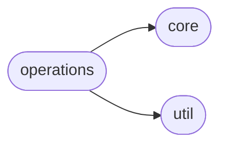

# Pythonflow Operations

[_Documentation generated by Documatic_](https://www.documatic.com)

<!---Documatic-section-Codebase Structure-start--->
## Codebase Structure

<!---Documatic-block-system_architecture-start--->

<!---Documatic-block-system_architecture-end--->

# #
<!---Documatic-section-Codebase Structure-end--->

<!---Documatic-section-pythonflow.operations.str_format-start--->
## [pythonflow.operations.str_format](3-pythonflow_operations.md#pythonflow.operations.str_format)

<!---Documatic-section-str_format-start--->
<!---Documatic-block-pythonflow.operations.str_format-start--->
<details>
	<summary><code>pythonflow.operations.str_format</code> code snippet</summary>

```python
@opmethod
def str_format(format_string, *args, **kwargs):
    return format_string.format(*args, **kwargs)
```
</details>
<!---Documatic-block-pythonflow.operations.str_format-end--->
<!---Documatic-section-str_format-end--->

# #
<!---Documatic-section-pythonflow.operations.str_format-end--->

<!---Documatic-section-pythonflow.operations.placeholder-start--->
## [pythonflow.operations.placeholder](3-pythonflow_operations.md#pythonflow.operations.placeholder)

<!---Documatic-section-placeholder-start--->
<!---Documatic-block-pythonflow.operations.placeholder-start--->
<details>
	<summary><code>pythonflow.operations.placeholder</code> code snippet</summary>

```python
class placeholder(Operation):

    def __init__(self, name=None, **kwargs):
        super(placeholder, self).__init__(name=name, **kwargs)

    def _evaluate(self):
        raise ValueError("missing value for placeholder '%s'" % self.name)

    def __repr__(self):
        return "<pf.placeholder '%s'>" % self.name
```
</details>
<!---Documatic-block-pythonflow.operations.placeholder-end--->
<!---Documatic-section-placeholder-end--->

# #
<!---Documatic-section-pythonflow.operations.placeholder-end--->

<!---Documatic-section-pythonflow.operations._pickle_dump-start--->
## [pythonflow.operations._pickle_dump](3-pythonflow_operations.md#pythonflow.operations._pickle_dump)

<!---Documatic-section-_pickle_dump-start--->
<!---Documatic-block-pythonflow.operations._pickle_dump-start--->
<details>
	<summary><code>pythonflow.operations._pickle_dump</code> code snippet</summary>

```python
def _pickle_dump(value, filename):
    with open(filename, 'wb') as fp:
        pickle.dump(value, fp)
```
</details>
<!---Documatic-block-pythonflow.operations._pickle_dump-end--->
<!---Documatic-section-_pickle_dump-end--->

# #
<!---Documatic-section-pythonflow.operations._pickle_dump-end--->

<!---Documatic-section-pythonflow.operations.conditional-start--->
## [pythonflow.operations.conditional](3-pythonflow_operations.md#pythonflow.operations.conditional)

<!---Documatic-section-conditional-start--->
<!---Documatic-block-pythonflow.operations.conditional-start--->
<details>
	<summary><code>pythonflow.operations.conditional</code> code snippet</summary>

```python
class conditional(Operation):

    def __init__(self, predicate, x, y=None, *, length=None, name=None, dependencies=None):
        super(conditional, self).__init__(predicate, x, y, length=length, name=name, dependencies=dependencies)

    def evaluate(self, context, callback=None):
        callback = callback or _noop_callback
        self.evaluate_dependencies(context, callback)
        (predicate, x, y) = self.args
        predicate = self.evaluate_operation(predicate, context, callback=callback)
        with callback(self, context):
            value = self.evaluate_operation(x if predicate else y, context, callback=callback)
            context[self] = value
        return value
```
</details>
<!---Documatic-block-pythonflow.operations.conditional-end--->
<!---Documatic-section-conditional-end--->

# #
<!---Documatic-section-pythonflow.operations.conditional-end--->

<!---Documatic-section-pythonflow.operations.identity-start--->
## [pythonflow.operations.identity](3-pythonflow_operations.md#pythonflow.operations.identity)

<!---Documatic-section-identity-start--->
<!---Documatic-block-pythonflow.operations.identity-start--->
<details>
	<summary><code>pythonflow.operations.identity</code> code snippet</summary>

```python
@opmethod
def identity(value):
    return value
```
</details>
<!---Documatic-block-pythonflow.operations.identity-end--->
<!---Documatic-section-identity-end--->

# #
<!---Documatic-section-pythonflow.operations.identity-end--->

<!---Documatic-section-pythonflow.operations._pickle_load-start--->
## [pythonflow.operations._pickle_load](3-pythonflow_operations.md#pythonflow.operations._pickle_load)

<!---Documatic-section-_pickle_load-start--->
<!---Documatic-block-pythonflow.operations._pickle_load-start--->
<details>
	<summary><code>pythonflow.operations._pickle_load</code> code snippet</summary>

```python
def _pickle_load(filename):
    with open(filename, 'rb') as fp:
        return pickle.load(fp)
```
</details>
<!---Documatic-block-pythonflow.operations._pickle_load-end--->
<!---Documatic-section-_pickle_load-end--->

# #
<!---Documatic-section-pythonflow.operations._pickle_load-end--->

<!---Documatic-section-pythonflow.operations.assert_-start--->
## [pythonflow.operations.assert_](3-pythonflow_operations.md#pythonflow.operations.assert_)

<!---Documatic-section-assert_-start--->
<!---Documatic-block-pythonflow.operations.assert_-start--->
<details>
	<summary><code>pythonflow.operations.assert_</code> code snippet</summary>

```python
@opmethod
def assert_(condition, message=None, *args, value=None):
    if message:
        assert condition, message % args
    else:
        assert condition
    return value
```
</details>
<!---Documatic-block-pythonflow.operations.assert_-end--->
<!---Documatic-section-assert_-end--->

# #
<!---Documatic-section-pythonflow.operations.assert_-end--->

<!---Documatic-section-pythonflow.operations.try_-start--->
## [pythonflow.operations.try_](3-pythonflow_operations.md#pythonflow.operations.try_)

<!---Documatic-section-try_-start--->
<!---Documatic-block-pythonflow.operations.try_-start--->
<details>
	<summary><code>pythonflow.operations.try_</code> code snippet</summary>

```python
class try_(Operation):

    def __init__(self, operation, except_=None, finally_=None, **kwargs):
        except_ = except_ or []
        super(try_, self).__init__(operation, except_, finally_, **kwargs)

    def evaluate(self, context, callback=None):
        callback = callback or _noop_callback
        self.evaluate_dependencies(context, callback=callback)
        (operation, except_, finally_) = self.args
        with callback(self, context):
            try:
                value = self.evaluate_operation(operation, context, callback=callback)
                context[self] = value
                return value
            except:
                (_, ex, _) = sys.exc_info()
                for (type_, alternative) in except_:
                    if isinstance(ex, type_):
                        value = self.evaluate_operation(alternative, context, callback=callback)
                        context[self] = value
                        return value
                raise
            finally:
                if finally_:
                    self.evaluate_operation(finally_, context)
```
</details>
<!---Documatic-block-pythonflow.operations.try_-end--->
<!---Documatic-section-try_-end--->

# #
<!---Documatic-section-pythonflow.operations.try_-end--->

<!---Documatic-section-pythonflow.operations.lazy_constant-start--->
## [pythonflow.operations.lazy_constant](3-pythonflow_operations.md#pythonflow.operations.lazy_constant)

<!---Documatic-section-lazy_constant-start--->
<!---Documatic-block-pythonflow.operations.lazy_constant-start--->
<details>
	<summary><code>pythonflow.operations.lazy_constant</code> code snippet</summary>

```python
class lazy_constant(Operation):

    def __init__(self, target, **kwargs):
        super(lazy_constant, self).__init__(**kwargs)
        self.target = target
        if not callable(self.target):
            raise ValueError('`target` must be callable')
        self.value = None

    def _evaluate(self):
        if self.value is None:
            self.value = self.target()
        return self.value
```
</details>
<!---Documatic-block-pythonflow.operations.lazy_constant-end--->
<!---Documatic-section-lazy_constant-end--->

# #
<!---Documatic-section-pythonflow.operations.lazy_constant-end--->

<!---Documatic-section-pythonflow.operations.cache-start--->
## [pythonflow.operations.cache](3-pythonflow_operations.md#pythonflow.operations.cache)

<!---Documatic-section-cache-start--->


### Object Calls

* [pythonflow.operations.try_](3-pythonflow_operations.md#pythonflow.operations.try_)
* [pythonflow.core.func_op](4-pythonflow_core.md#pythonflow.core.func_op)
* pythonflow.core.hash_
* [pythonflow.operations.identity](3-pythonflow_operations.md#pythonflow.operations.identity)

<!---Documatic-block-pythonflow.operations.cache-start--->
<details>
	<summary><code>pythonflow.operations.cache</code> code snippet</summary>

```python
def cache(operation, get, put, key=None):
    if not key:
        dependencies = operation.args + tuple(operation.kwargs.values())
        key = hash_(dependencies)
    return try_(func_op(get, key), [((KeyError, FileNotFoundError), identity(operation, dependencies=[func_op(put, key, operation)]))])
```
</details>
<!---Documatic-block-pythonflow.operations.cache-end--->
<!---Documatic-section-cache-end--->

# #
<!---Documatic-section-pythonflow.operations.cache-end--->

<!---Documatic-section-pythonflow.operations.Logger-start--->
## [pythonflow.operations.Logger](3-pythonflow_operations.md#pythonflow.operations.Logger)

<!---Documatic-section-Logger-start--->
<!---Documatic-block-pythonflow.operations.Logger-start--->
<details>
	<summary><code>pythonflow.operations.Logger</code> code snippet</summary>

```python
@deprecated
class Logger:

    def __init__(self, logger_name=None):
        self.logger = logging.getLogger(logger_name)

    @functools.wraps(logging.Logger.log)
    def log(self, level, message, *args, **kwargs):
        if isinstance(level, str):
            level = getattr(logging, level.upper())
        return func_op(self.logger.log, level, message, *args, **kwargs)

    @functools.wraps(logging.Logger.debug)
    def debug(self, message, *args, **kwargs):
        return func_op(self.logger.debug, message, *args, **kwargs)

    @functools.wraps(logging.Logger.info)
    def info(self, message, *args, **kwargs):
        return func_op(self.logger.info, message, *args, **kwargs)

    @functools.wraps(logging.Logger.warning)
    def warning(self, message, *args, **kwargs):
        return func_op(self.logger.warning, message, *args, **kwargs)

    @functools.wraps(logging.Logger.error)
    def error(self, message, *args, **kwargs):
        return func_op(self.logger.error, message, *args, **kwargs)

    @functools.wraps(logging.Logger.critical)
    def critical(self, message, *args, **kwargs):
        return func_op(self.logger.critical, message, *args, **kwargs)
```
</details>
<!---Documatic-block-pythonflow.operations.Logger-end--->
<!---Documatic-section-Logger-end--->

# #
<!---Documatic-section-pythonflow.operations.Logger-end--->

<!---Documatic-section-pythonflow.operations.cache_file-start--->
## [pythonflow.operations.cache_file](3-pythonflow_operations.md#pythonflow.operations.cache_file)

<!---Documatic-section-cache_file-start--->


### Object Calls

* [pythonflow.operations.cache](3-pythonflow_operations.md#pythonflow.operations.cache)

<!---Documatic-block-pythonflow.operations.cache_file-start--->
<details>
	<summary><code>pythonflow.operations.cache_file</code> code snippet</summary>

```python
def cache_file(operation, filename_template, load=None, dump=None, key=None):
    load = load or _pickle_load
    dump = dump or _pickle_dump
    return cache(operation, lambda key_: load(filename_template % key_), lambda key_, value: dump(value, filename_template % key_), key)
```
</details>
<!---Documatic-block-pythonflow.operations.cache_file-end--->
<!---Documatic-section-cache_file-end--->

# #
<!---Documatic-section-pythonflow.operations.cache_file-end--->

[_Documentation generated by Documatic_](https://www.documatic.com)