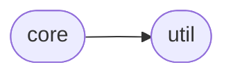
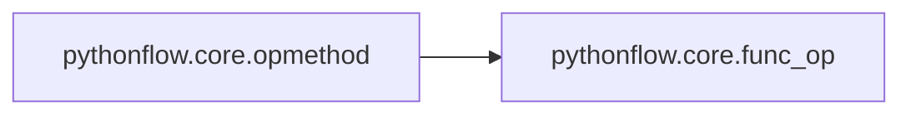

# Pythonflow Core

[_Documentation generated by Documatic_](https://www.documatic.com)

<!---Documatic-section-Codebase Structure-start--->
## Codebase Structure

<!---Documatic-block-system_architecture-start--->

<!---Documatic-block-system_architecture-end--->

# #
<!---Documatic-section-Codebase Structure-end--->

<!---Documatic-section-pythonflow.core.opmethod-start--->
## [pythonflow.core.opmethod](4-pythonflow_core.md#pythonflow.core.opmethod)

<!---Documatic-section-opmethod-start--->


### Object Calls

* [pythonflow.core.func_op](4-pythonflow_core.md#pythonflow.core.func_op)

<!---Documatic-block-pythonflow.core.opmethod-start--->
<details>
	<summary><code>pythonflow.core.opmethod</code> code snippet</summary>

```python
def opmethod(target=None, **kwargs):
    if target is None:
        return functools.partial(opmethod, **kwargs)

    @functools.wraps(target)
    def _wrapper(*args, **kwargs_inner):
        return func_op(target, *args, **kwargs_inner, **kwargs)
    return _wrapper
```
</details>
<!---Documatic-block-pythonflow.core.opmethod-end--->
<!---Documatic-section-opmethod-end--->

# #
<!---Documatic-section-pythonflow.core.opmethod-end--->

<!---Documatic-section-pythonflow.core.func_op-start--->
## [pythonflow.core.func_op](4-pythonflow_core.md#pythonflow.core.func_op)

<!---Documatic-section-func_op-start--->
<!---Documatic-block-pythonflow.core.func_op-start--->
<details>
	<summary><code>pythonflow.core.func_op</code> code snippet</summary>

```python
class func_op(Operation):

    def __init__(self, target, *args, **kwargs):
        super(func_op, self).__init__(*args, **kwargs)
        self.target = target

    def _evaluate(self, *args, **kwargs):
        return self.target(*args, **kwargs)

    def __repr__(self):
        return "<pf.func_op '%s' target=%s args=<%d items> kwargs=<%d items>>" % (self.name, self.target, len(self.args), len(self.kwargs))
```
</details>
<!---Documatic-block-pythonflow.core.func_op-end--->
<!---Documatic-section-func_op-end--->

# #
<!---Documatic-section-pythonflow.core.func_op-end--->

<!---Documatic-section-pythonflow.core.call-start--->
## [pythonflow.core.call](4-pythonflow_core.md#pythonflow.core.call)

<!---Documatic-section-call-start--->
<!---Documatic-block-pythonflow.core.call-start--->
<details>
	<summary><code>pythonflow.core.call</code> code snippet</summary>

```python
@opmethod
def call(func, *args, **kwargs):
    return func(*args, **kwargs)
```
</details>
<!---Documatic-block-pythonflow.core.call-end--->
<!---Documatic-section-call-end--->

# #
<!---Documatic-section-pythonflow.core.call-end--->

<!---Documatic-section-pythonflow.core.EvaluationError-start--->
## [pythonflow.core.EvaluationError](4-pythonflow_core.md#pythonflow.core.EvaluationError)

<!---Documatic-section-EvaluationError-start--->
<!---Documatic-block-pythonflow.core.EvaluationError-start--->
<details>
	<summary><code>pythonflow.core.EvaluationError</code> code snippet</summary>

```python
class EvaluationError(RuntimeError):
```
</details>
<!---Documatic-block-pythonflow.core.EvaluationError-end--->
<!---Documatic-section-EvaluationError-end--->

# #
<!---Documatic-section-pythonflow.core.EvaluationError-end--->

<!---Documatic-section-pythonflow.core.Operation-start--->
## [pythonflow.core.Operation](4-pythonflow_core.md#pythonflow.core.Operation)

<!---Documatic-section-Operation-start--->
<!---Documatic-block-pythonflow.core.Operation-start--->
<details>
	<summary><code>pythonflow.core.Operation</code> code snippet</summary>

```python
class Operation:

    def __init__(self, *args, length=None, graph=None, name=None, dependencies=None, **kwargs):
        self.args = args
        self.kwargs = kwargs
        self.length = length
        self.graph = Graph.get_active_graph(graph)
        self._name = None
        self.name = name or uuid.uuid4().hex
        self.dependencies = [] if dependencies is None else dependencies
        self.dependencies.extend(self.graph.dependencies)
        self._stack = traceback.extract_stack()

    def __getstate__(self):
        return self.__dict__

    def __setstate__(self, data):
        self.__dict__.update(data)

    @property
    def name(self):
        """str : Unique name of the operation"""
        return self._name

    @name.setter
    def name(self, name):
        self.set_name(name)

    def set_name(self, name):
        """
        Set the name of the operation and update the graph.

        Parameters
        ----------
        value : str
            Unique name of the operation.

        Returns
        -------
        self : Operation
            This operation.

        Raises
        ------
        ValueError
            If an operation with `value` already exists in the associated graph.
        KeyError
            If the current name of the operation cannot be found in the associated graph.
        """
        if name in self.graph.operations:
            raise ValueError(f"duplicate name '{name}'")
        if self._name is not None:
            self.graph.operations.pop(self._name)
        self.graph.operations[name] = self
        self._name = name
        return self

    def evaluate_dependencies(self, context, callback=None):
        """
        Evaluate the dependencies of this operation and discard the values.

        Parameters
        ----------
        context : dict
            Normalised context in which to evaluate the operation.
        callback : callable or None
            Callback to be evaluated when an operation is evaluated.
        """
        for operation in self.dependencies:
            operation.evaluate(context, callback)

    def evaluate(self, context, callback=None):
        """
        Evaluate the operation given a context.

        Parameters
        ----------
        context : dict
            Normalised context in which to evaluate the operation.
        callback : callable or None
            Callback to be evaluated when an operation is evaluated.

        Returns
        -------
        value : object
            Output of the operation given the context.
        """
        self.evaluate_dependencies(context, callback)
        if self in context:
            return context[self]
        partial = functools.partial(self.evaluate_operation, context=context, callback=callback)
        args = [partial(arg) for arg in self.args]
        kwargs = {key: partial(value) for (key, value) in self.kwargs.items()}
        callback = callback or _noop_callback
        with callback(self, context):
            context[self] = value = self._evaluate(*args, **kwargs)
        return value

    def _evaluate(self, *args, **kwargs):
        """
        Inheriting operations should implement this function to evaluate the operation.
        """
        raise NotImplementedError

    @classmethod
    def evaluate_operation(cls, operation, context, **kwargs):
        """
        Evaluate an operation or constant given a context.
        """
        try:
            if isinstance(operation, Operation):
                return operation.evaluate(context, **kwargs)
            partial = functools.partial(cls.evaluate_operation, context=context, **kwargs)
            if isinstance(operation, tuple):
                return tuple((partial(element) for element in operation))
            if isinstance(operation, list):
                return [partial(element) for element in operation]
            if isinstance(operation, dict):
                return {partial(key): partial(value) for (key, value) in operation.items()}
            if isinstance(operation, slice):
                return slice(*[partial(getattr(operation, attr)) for attr in ['start', 'stop', 'step']])
            return operation
        except Exception as ex:
            stack = []
            interactive = False
            for frame in reversed(operation._stack):
                if 'pythonflow' in frame.filename:
                    continue
                if interactive and (not frame.filename.startswith('<')):
                    break
                interactive = frame.filename.startswith('<')
                stack.append(frame)
            stack = ''.join(traceback.format_list(reversed(stack)))
            message = 'Failed to evaluate operation `%s` defined at:\n\n%s' % (operation, stack)
            raise ex from EvaluationError(message)

    def __bool__(self):
        return True

    def __hash__(self):
        return id(self)

    def __len__(self):
        if self.length is None:
            raise TypeError('`length` must be specified explicitly for operations')
        return self.length

    def __iter__(self):
        num = len(self)
        for i in range(num):
            yield self[i]

    def __getattr__(self, name):
        return getattr_(self, name, graph=self.graph)

    def __getitem__(self, key):
        return getitem(self, key, graph=self.graph)

    def __add__(self, other):
        return add(self, other, graph=self.graph)

    def __radd__(self, other):
        return add(other, self, graph=self.graph)

    def __sub__(self, other):
        return sub(self, other, graph=self.graph)

    def __rsub__(self, other):
        return sub(other, self, graph=self.graph)

    def __pow__(self, other):
        return pow_(self, other, graph=self.graph)

    def __rpow__(self, other):
        return pow_(other, self, graph=self.graph)

    def __mul__(self, other):
        return mul(self, other, graph=self.graph)

    def __matmul__(self, other):
        return matmul(self, other, graph=self.graph)

    def __rmatmul__(self, other):
        return matmul(other, self, graph=self.graph)

    def __rmul__(self, other):
        return mul(other, self, graph=self.graph)

    def __truediv__(self, other):
        return truediv(self, other, graph=self.graph)

    def __rtruediv__(self, other):
        return truediv(other, self, graph=self.graph)

    def __floordiv__(self, other):
        return floordiv(self, other, graph=self.graph)

    def __rfloordiv__(self, other):
        return floordiv(other, self, graph=self.graph)

    def __mod__(self, other):
        return mod(self, other, graph=self.graph)

    def __rmod__(self, other):
        return mod(other, self, graph=self.graph)

    def __lshift__(self, other):
        return lshift(self, other, graph=self.graph)

    def __rlshift__(self, other):
        return lshift(other, self, graph=self.graph)

    def __rshift__(self, other):
        return rshift(self, other, graph=self.graph)

    def __rrshift__(self, other):
        return rshift(other, self, graph=self.graph)

    def __and__(self, other):
        return and_(self, other, graph=self.graph)

    def __rand__(self, other):
        return and_(other, self, graph=self.graph)

    def __or__(self, other):
        return or_(self, other, graph=self.graph)

    def __ror__(self, other):
        return or_(other, self, graph=self.graph)

    def __xor__(self, other):
        return xor(self, other, graph=self.graph)

    def __rxor__(self, other):
        return xor(other, self, graph=self.graph)

    def __lt__(self, other):
        return lt(self, other, graph=self.graph)

    def __le__(self, other):
        return le(self, other, graph=self.graph)

    def __eq__(self, other):
        return eq(self, other, graph=self.graph)

    def __ne__(self, other):
        return ne(self, other, graph=self.graph)

    def __gt__(self, other):
        return gt(self, other, graph=self.graph)

    def __ge__(self, other):
        return ge(self, other, graph=self.graph)

    def __invert__(self):
        return inv(self, graph=self.graph)

    def __neg__(self):
        return neg(self, graph=self.graph)

    def __abs__(self):
        return abs_(self, graph=self.graph)

    def __pos__(self):
        return pos(self, graph=self.graph)

    def __reversed__(self):
        return reversed_(self, graph=self.graph)

    def __call__(self, *args, **kwargs):
        return call(self, *args, **kwargs)
```
</details>
<!---Documatic-block-pythonflow.core.Operation-end--->
<!---Documatic-section-Operation-end--->

# #
<!---Documatic-section-pythonflow.core.Operation-end--->

<!---Documatic-section-pythonflow.core.control_dependencies-start--->
## [pythonflow.core.control_dependencies](4-pythonflow_core.md#pythonflow.core.control_dependencies)

<!---Documatic-section-control_dependencies-start--->
<!---Documatic-block-pythonflow.core.control_dependencies-start--->
<details>
	<summary><code>pythonflow.core.control_dependencies</code> code snippet</summary>

```python
@contextlib.contextmanager
def control_dependencies(dependencies, graph=None):
    graph = Graph.get_active_graph(graph)
    graph.dependencies.extend(dependencies)
    yield
    del graph.dependencies[-len(dependencies):]
```
</details>
<!---Documatic-block-pythonflow.core.control_dependencies-end--->
<!---Documatic-section-control_dependencies-end--->

# #
<!---Documatic-section-pythonflow.core.control_dependencies-end--->

<!---Documatic-section-pythonflow.core.Graph-start--->
## [pythonflow.core.Graph](4-pythonflow_core.md#pythonflow.core.Graph)

<!---Documatic-section-Graph-start--->
<!---Documatic-block-pythonflow.core.Graph-start--->
<details>
	<summary><code>pythonflow.core.Graph</code> code snippet</summary>

```python
class Graph:

    def __init__(self):
        self.operations = {}
        self.dependencies = []
    _globals = threading.local()

    def __enter__(self):
        assert getattr(self._globals, 'default_graph', None) is None, 'cannot have more than one default graph'
        Graph._globals.default_graph = self
        return self

    def __exit__(self, *args):
        assert self._globals.default_graph is self
        Graph._globals.default_graph = None

    def normalize_operation(self, operation):
        """
        Normalize an operation by resolving its name if necessary.

        Parameters
        ----------
        operation : Operation or str
            Operation instance or name of an operation.

        Returns
        -------
        normalized_operation : Operation
            Operation instance.

        Raises
        ------
        ValueError
            If `operation` is not an `Operation` instance or an operation name.
        RuntimeError
            If `operation` is an `Operation` instance but does not belong to this graph.
        KeyError
            If `operation` is an operation name that does not match any operation of this graph.
        """
        if isinstance(operation, Operation):
            if operation.graph is not self:
                raise RuntimeError(f"operation '{operation}' does not belong to this graph")
            return operation
        if isinstance(operation, str):
            return self.operations[operation]
        raise ValueError(f"'{operation}' is not an `Operation` instance or operation name")

    def normalize_context(self, context, **kwargs):
        """
        Normalize a context by replacing all operation names with operation instances.

        .. note::
           This function modifies the context in place. Use :code:`context=context.copy()` to avoid
           the context being modified.

        Parameters
        ----------
        context : dict[Operation or str, object]
            Context whose keys are operation instances or names.
        kwargs : dict[str, object]
            Additional context information keyed by variable name.

        Returns
        -------
        normalized_context : dict[Operation, object]
            Normalized context whose keys are operation instances.

        Raises
        ------
        ValueError
            If the context specifies more than one value for any operation.
        ValueError
            If `context` is not a mapping.
        """
        if context is None:
            context = {}
        elif not isinstance(context, collections.abc.Mapping):
            raise ValueError('`context` must be a mapping.')
        operations = list(context)
        for operation in operations:
            value = context.pop(operation)
            operation = self.normalize_operation(operation)
            if operation in context:
                raise ValueError(f"duplicate value for operation '{operation}'")
            context[operation] = value
        for (name, value) in kwargs.items():
            operation = self.operations[name]
            if operation in context:
                raise ValueError(f"duplicate value for operation '{operation}'")
            context[operation] = value
        return context

    def apply(self, fetches, context=None, *, callback=None, **kwargs):
        """
        Evaluate one or more operations given a context.

        .. note::
           This function modifies the context in place. Use :code:`context=context.copy()` to avoid
           the context being modified.

        Parameters
        ----------
        fetches : list[str or Operation] or str or Operation
            One or more `Operation` instances or names to evaluate.
        context : dict or None
            Context in which to evaluate the operations.
        callback : callable or None
            Callback to be evaluated when an operation is evaluated.
        kwargs : dict
            Additional context information keyed by variable name.

        Returns
        -------
        values : tuple[object]
            Output of the operations given the context.

        Raises
        ------
        ValueError
            If `fetches` is not an `Operation` instance, operation name, or a sequence thereof.
        ValueError
            If `context` is not a mapping.
        """
        if isinstance(fetches, (str, Operation)):
            fetches = [fetches]
            single = True
        elif isinstance(fetches, collections.abc.Sequence):
            single = False
        else:
            raise ValueError('`fetches` must be an `Operation` instance, operation name, or a sequence thereof.')
        fetches = [self.normalize_operation(operation) for operation in fetches]
        context = self.normalize_context(context, **kwargs)
        values = [fetch.evaluate_operation(fetch, context, callback=callback) for fetch in fetches]
        return values[0] if single else tuple(values)
    __call__ = apply

    def __getitem__(self, name):
        return self.operations[name]

    @staticmethod
    def get_active_graph(graph=None):
        """
        Obtain the currently active graph instance by returning the explicitly given graph or using
        the default graph.

        Parameters
        ----------
        graph : Graph or None
            Graph to return or `None` to use the default graph.

        Raises
        ------
        ValueError
            If no `Graph` instance can be obtained.
        """
        graph = graph or Graph._globals.default_graph
        if not graph:
            raise ValueError('`graph` must be given explicitly or a default graph must be set')
        return graph
```
</details>
<!---Documatic-block-pythonflow.core.Graph-end--->
<!---Documatic-section-Graph-end--->

# #
<!---Documatic-section-pythonflow.core.Graph-end--->

[_Documentation generated by Documatic_](https://www.documatic.com)