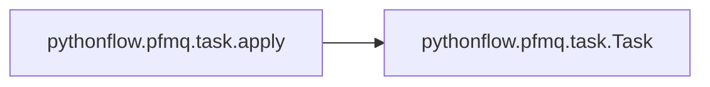

# Pythonflow Pfmq

[_Documentation generated by Documatic_](https://www.documatic.com)

<!---Documatic-section-Codebase Structure-start--->
## Codebase Structure

<!---Documatic-block-system_architecture-start--->
```mermaid
None
```
<!---Documatic-block-system_architecture-end--->

# #
<!---Documatic-section-Codebase Structure-end--->

<!---Documatic-section-pythonflow.pfmq.task.apply-start--->
## [pythonflow.pfmq.task.apply](6-pythonflow_pfmq.md#pythonflow.pfmq.task.apply)

<!---Documatic-section-apply-start--->


### Object Calls

* [pythonflow.pfmq.task.Task](6-pythonflow_pfmq.md#pythonflow.pfmq.task.Task)

<!---Documatic-block-pythonflow.pfmq.task.apply-start--->
<details>
	<summary><code>pythonflow.pfmq.task.apply</code> code snippet</summary>

```python
def apply(request, frontend_address, **kwargs):
    task = Task([request], frontend_address, start=False, **kwargs)
    task.run()
    for result in task.iter_results(timeout=0):
        return result
```
</details>
<!---Documatic-block-pythonflow.pfmq.task.apply-end--->
<!---Documatic-section-apply-end--->

# #
<!---Documatic-section-pythonflow.pfmq.task.apply-end--->

<!---Documatic-section-pythonflow.pfmq.task.Task-start--->
## [pythonflow.pfmq.task.Task](6-pythonflow_pfmq.md#pythonflow.pfmq.task.Task)

<!---Documatic-section-Task-start--->
<!---Documatic-block-pythonflow.pfmq.task.Task-start--->
<details>
	<summary><code>pythonflow.pfmq.task.Task</code> code snippet</summary>

```python
class Task(Base):

    def __init__(self, requests, address, dumps=None, loads=None, start=True, timeout=10, max_retries=3, max_results=1024):
        self.requests = requests
        self.address = address
        self.dumps = dumps or pickle.dumps
        self.loads = loads or pickle.loads
        self.max_results = max_results
        self.results = queue.Queue(self.max_results)
        self.timeout = timeout
        self.max_retries = max_retries
        super(Task, self).__init__(start)

    def run(self):
        context = zmq.Context.instance()
        num_retries = 0
        identity = uuid.uuid4().bytes
        pending = collections.OrderedDict()
        requests = iter(enumerate(self.requests, 0))
        current_identifier = last_identifier = None
        next_identifier = 0
        cache = {}
        while True:
            with context.socket(zmq.PAIR) as cancel, context.socket(zmq.REQ) as socket:
                cancel.connect(self._cancel_address)
                socket.setsockopt(zmq.IDENTITY, identity)
                socket.connect(self.address)
                poller = zmq.Poller()
                poller.register(socket, zmq.POLLIN)
                poller.register(cancel, zmq.POLLIN)
                LOGGER.debug('connected %s to %s', identity, self.address)
                while True:
                    LOGGER.debug('%d pending messages', len(pending))
                    identifier = message = None
                    for (candidate, item) in pending.items():
                        delta = time.time() - item['time']
                        if delta > self.timeout:
                            identifier = candidate
                            LOGGER.info('request with identifier %d timed out', identifier)
                            message = item['message']
                        break
                    if identifier is None:
                        try:
                            (identifier, request) = next(requests)
                            num_bytes = max((identifier.bit_length() + 7) // 8, 1)
                            message = [identifier.to_bytes(num_bytes, 'little'), self.dumps(request)]
                            current_identifier = identifier
                            LOGGER.debug('new request with identifier %d', identifier)
                        except StopIteration:
                            last_identifier = last_identifier or current_identifier
                            identifier = None
                            message = [b'']
                            LOGGER.debug('no more requests; waiting for responses')
                    socket.send_multipart(message)
                    LOGGER.debug('sent REQUEST with identifier %s: %s', identifier, message)
                    if identifier is not None:
                        pending[identifier] = {'message': message, 'time': time.time()}
                    del identifier
                    LOGGER.debug('polling...')
                    sockets = dict(poller.poll(1000 * self.timeout))
                    if not sockets:
                        num_retries += 1
                        LOGGER.info('time out #%d for %s after %.3f seconds', num_retries, self.address, self.timeout)
                        if self.max_retries and num_retries >= self.max_retries:
                            message = 'maximum number of retries (%d) for %s exceeded' % (self.max_retries, self.address)
                            LOGGER.error(message)
                            self.results.put(('timeout', TimeoutError(message)))
                            return
                        break
                    num_retries = 0
                    if sockets.get(cancel) == zmq.POLLIN:
                        LOGGER.debug('received CANCEL signal on %s', self._cancel_address)
                        return
                    if sockets.get(socket) == zmq.POLLIN:
                        (identifier, *response) = socket.recv_multipart()
                        if not identifier:
                            LOGGER.debug('received dispatch notification')
                            continue
                        identifier = int.from_bytes(identifier, 'little')
                        LOGGER.debug('received RESPONSE for identifier %d (next: %d, end: %s)', identifier, next_identifier, last_identifier)
                        pending.pop(identifier, None)
                        if identifier < next_identifier:
                            LOGGER.debug('dropped RESPONSE with identifier %d (next: %d)', identifier, next_identifier)
                            continue
                        cache[identifier] = response
                        while True:
                            try:
                                (status, response) = cache.pop(next_identifier)
                                status = self.STATUS[status]
                                self.results.put((status, identifier if status == 'serialization_error' else self.loads(response)))
                                if next_identifier == last_identifier:
                                    self.results.put(('end', None))
                                    return
                                next_identifier += 1
                            except KeyError:
                                break

    def iter_results(self, timeout=None):
        """
        Iterate over the results.

        Parameters
        ----------
        timeout : float
            Timeout for getting results.
        """
        while True:
            (status, result) = self.results.get(timeout=timeout)
            if status == 'ok':
                yield result
            elif status in 'error':
                (value, tb) = result
                LOGGER.error(tb)
                raise value
            elif status == 'timeout':
                raise result
            elif status == 'end':
                return
            elif status == 'serialization_error':
                raise SerializationError('failed to serialize result for request with identifier %s' % result)
            else:
                raise KeyError(status)

    def __iter__(self):
        return self.iter_results()
```
</details>
<!---Documatic-block-pythonflow.pfmq.task.Task-end--->
<!---Documatic-section-Task-end--->

# #
<!---Documatic-section-pythonflow.pfmq.task.Task-end--->

[_Documentation generated by Documatic_](https://www.documatic.com)